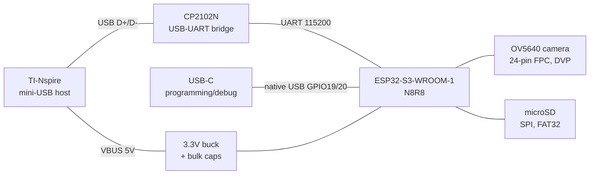

# nternet-Link V4 — custom PCB design (KiCad)

One board replaces the hand-wired XIAO + CP2102 sandwich: ESP32-S3,
USB bridge to the calculator, OV5640 camera connector, microSD, and a
programming interface.

## Form factor: ≤ 60 × 12.5 mm stick

The 12.5 mm width target rules out every ESP32-S3 module — WROOM-1 is
18 mm wide, MINI-1 is 15.4 mm, the XIAO is 17.5 mm. So this is a
**bare-chip design**: ESP32-S3R8 (QFN56, 7×7 mm, 8 MB PSRAM in-package)
plus external QSPI flash and a ceramic chip antenna. That's more layout
work (RF matching, crystal, antenna clearance) but it's the only honest
route to 12.5 mm — and it's how every commercial USB-stick ESP32 product
does it.

**Decision (2026-08-11): both variants, one project family.** Variant A
`nlink-proto` (ESP32-S3-MINI-1-N4R2, ~60×16 mm) gets built and debugged
first; Variant B `nlink-stick` (bare S3R8, ≤60×12.5 mm) is the shrink once
everything else is proven. Shared hierarchical sheets, per-variant MCU sheet —
see `kicad/CAPTURE-PLAN.md` for the sheet structure, final GPIO allocation,
and net-by-net capture tables. The rest of this document describes the
Variant B endpoint; Variant A simply swaps the bare-chip cluster for the
module.

Placement along the stick (60 mm), calculator end → free end:

```
[mini-B plug]│[ESD|CP2102N]│[buck]│[S3R8+flash+xtal]│[FPC(rotated)]│[antenna]
   0–8 mm        8–20 mm    20–26    26–42 mm            42–53 mm     53–60
                          microSD (Hirose DM3D-class, back side, ~30–45 mm)
                          program pads (TC2030 / pogo, back side)
```

Width-critical parts and how they fit in 12.5 mm:

| Part | Width | Fit |
| ---- | ----- | --- |
| ESP32-S3R8 QFN56 | 7 mm | fine, fanout on both sides |
| CP2102N-A02-GQFN24 | 4 mm | fine |
| 24-pin 0.5 mm FPC connector | ~14 mm across contacts | **rotate 90°** — contact row runs along the board length, flex enters from the side and the camera folds flat over the stick |
| microSD socket | 12.4 mm (Hirose DM3D-SF class) | just fits; card inserts from the side/back — verify the exact socket footprint before layout, most push-push sockets are 14 mm+ and do NOT fit |
| USB-C receptacle | ~9 mm | **deleted** — no room at either end (plug at one, antenna at the other). Program via Tag-Connect TC2030 footprint or 6 pogo pads (3V3, GND, EN, IO0, USB D+/D−) on the back. Zero-BOM-cost. |
| Chip antenna (e.g. Johanson 2450AT18B100) | 3.2×1.6 mm | needs the last ~7 mm of board as ground-free clearance on ALL layers, and no SD/FPC metal nearby |

Consequences of the stick format: 4-layer is mandatory (not just nice),
both sides are populated, and the OV5640's DVP bus (11 signals) plus SD
plus UART all have to share a 12.5 mm channel — expect the camera pin map
to shift from the XIAO-compatible defaults during fanout. That's fine:
`include/nlink_config.h` isolates the pin map behind `NLINK_BOARD_CUSTOM_PCB`,
so firmware adapts in one file.



## Bill of materials (core)

| Ref | Part | Package | Notes |
| --- | ---- | ------- | ----- |
| U1 | ESP32-S3R8 | QFN-56 7×7 | Bare chip; 8 MB **octal PSRAM in-package** (needed for the camera framebuffer). GPIO35/36/37 are consumed by that PSRAM: do not route them. |
| U2 | W25Q64JVXGIQ (8 MB QSPI flash) | USON-8 3×4 | Boot flash for U1. Keep traces to the flash pins short and matched-ish. |
| U3 | CP2102N-A02-GQFN24 | QFN-24 4×4 | USB-UART bridge facing the calculator. The Nspire already knows this chip — same as V1–V3. |
| U4 | 3.3 V buck, ≥1 A (e.g. TPS62A02 / TLV62569) | SOT/QFN | Buck, not LDO — WiFi+camera peaks make an AMS1117 a hand-warmer (V1 lesson). |
| U5 | USBLC6-2SC6 | SOT-23-6 | ESD on the calculator USB pair. |
| Y1 | 40 MHz crystal, ±10 ppm | 2016/3225 | With load caps per Espressif hardware design guide. |
| ANT1 | 2.4 GHz chip antenna (e.g. Johanson 2450AT18B100) + π match (2 caps, 1 ind) | 3.2×1.6 | At the free end; ground keepout under/around it on all layers. |
| J1 | USB **mini-B plug** (male), see below | — | Plugs into the calculator. |
| J2 | FPC connector, 24-pin, 0.5 mm pitch, bottom-contact | SMD, rotated 90° | OV5640 camera module (same modules the XIAO Sense uses). |
| J3 | microSD socket ≤12.5 mm wide (Hirose DM3D-SF class — verify) | SMD, back | SPI mode; card is plain FAT32, user-readable. |
| J4 | Tag-Connect TC2030 footprint or 6 pogo pads | back side | 3V3, GND, EN, IO0, USB D+/D− (GPIO19/20) → flash + native-USB debug with zero connector cost. |
| SW1 | Slide switch (or solder jumper) | SMD | Main power (VBUS side, before the buck). |
| — | 2× 100 µF X5R (or 1× 220 µF polymer) on 3.3 V + 22 µF on VBUS | — | WiFi TX bursts; brownouts are the classic ESP32-camera failure. In 12.5 mm width use several MLCCs, not one tall electrolytic. |
| — | Status LED + resistor, pull-ups, decoupling | — | 10 k pull-ups on SD CS/MISO; 100 nF per IC pin group. BOOT via program pads (IO0), no tact switches — no room. |

**The mini-B plug (J1) is the one awkward part.** PCB-mount mini-B *plugs*
are rare (receptacles are everywhere). Three workable options, best first:

1. Board-mount mini-B male connectors sold for adapter builds (search
   "mini USB male PCB solder type") — through-hole shell tabs, hand-solder.
2. A short mini-B pigtail cable soldered to castellated pads at the board
   edge (what V2 effectively did with the right-angle slim plug).
3. Design the enclosure so a right-angle slim mini-B plug (the V2 part)
   solders to edge pads — reuses your proven mechanical approach.

## Pin map (dev-hardware defaults from `include/nlink_config.h`)

These are the XIAO-S3-compatible defaults the firmware ships with. On the
bare-chip stick the camera/SD pins will likely move during fanout — update
the `NLINK_BOARD_CUSTOM_PCB` block in `nlink_config.h` to match the final
schematic and nothing else changes.

| Function | GPIO | | Function | GPIO |
| -------- | ---- |-| -------- | ---- |
| UART TX → CP2102N RXD | 43 | | CAM XCLK | 10 |
| UART RX ← CP2102N TXD | 44 | | CAM SIOD/SIOC | 40 / 39 |
| SD SCK | 7 | | CAM Y2–Y9 | 15, 17, 18, 16, 14, 12, 11, 48 |
| SD MISO | 8 | | CAM VSYNC | 38 |
| SD MOSI | 9 | | CAM HREF | 47 |
| SD CS | 21 | | CAM PCLK | 13 |
| Native USB D−/D+ | 19 / 20 | | BOOT / EN | 0 / EN |

Reserved, do not use: GPIO26–32 (flash), GPIO35–37 (octal PSRAM).

## Power budget

| State | Current @5V |
| ----- | ----------- |
| Idle, WiFi associated | ~80 mA |
| Camera streaming | ~250 mA |
| WiFi TX burst + camera | 450 mA+ peaks |

The Nspire's host port is not a generous supply. Mitigations, in order:
big bulk capacitance (above), `WiFi.setTxPower(WIFI_POWER_11dBm)` in firmware
during capture, and if it still browns out, a small LiPo + TP4056 charging
from VBUS makes the board self-powered (stretch goal — leave a footprint).

## KiCad workflow

- **Project:** `hardware/kicad/nlink-v4.kicad_pro`, hierarchical sheets:
  `power`, `mcu`, `usb-bridge`, `camera`, `sd`, `connectors`.
- **Symbols/footprints:** ESP32-S3-WROOM-1 and CP2102N are in KiCad's stock
  libraries (`RF_Module`, `Interface_USB`). For JLC-assembly parts, pull
  footprints with `easyeda2kicad --full --lcsc_id=Cxxxxx`.
- **Stackup:** 4-layer (sig / gnd / pwr / sig) — mandatory at this width.
  Solid L2 ground under everything except the antenna zone.
- **Routing rules:** USB D+/D− as 90 Ω differential pairs, length-matched,
  over solid ground — the calculator pair and the D+/D− going to the program
  pads. Camera DVP bus kept short and away from the buck. RF: 50 Ω trace
  from S3R8 LNA pin through the π-match to the antenna, ground cleared
  around the antenna on all four layers per the Johanson datasheet.
- **Bare-chip extras:** follow Espressif's ESP32-S3 hardware design
  guidelines for the crystal placement, RC on EN, and QSPI flash fanout.
  Budget one respin — first-spin RF on a bare chip usually needs a matching
  tweak, which is why the π-match gets three placeholder footprints.
- **Mechanical:** 60×12.5 mm stick matching the V2 enclosure concept; FPC
  connector on top face with the camera folding flat over the board; SD
  slot opening through the case side; program pads exposed through the back.
- **Checks before ordering:** DRC clean, then print 1:1 and stab the paper
  with the actual mini-B plug and SD card — the classic footprint-mirrored
  test that saves a respin.

## Bring-up order

1. Populate power only → verify 3.3 V, check for shorts.
2. Add ESP32-S3R8 + flash + crystal → flash "hello" via the program pads
   (native USB on GPIO19/20).
3. RF check: WiFi scan RSSI vs. a XIAO at the same distance; tweak π-match.
4. Add CP2102N → loopback: calculator sees a serial device, PING/PONG works.
5. Camera → `SNAP` from the debug console.
6. SD → `LS /` from the calculator.
