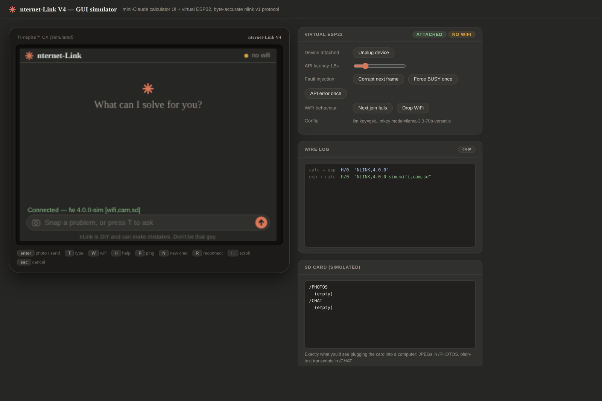

# nternet-Link V4

**Turn a TI-Nspire graphing calculator into a networked handheld terminal** —
Wi-Fi, an AI chat/tutor, a camera that reads and solves problems, and a
microSD card, all through a tiny plug-in device. No calculator modification.

V4 is a ground-up rewrite of the firmware, the calculator software, the
communication protocol, and the hardware — with two board designs: a full
camera stick and a tiny chat-only "stealth" version.

> **Not affiliated with Texas Instruments.** This is an embedded-systems and
> networking experiment. It is **not** designed or intended for use during
> exams. Follow your school's rules — don't be that guy.

---

## ▶ Try it first — the calculator UI runs in your browser

Before you build anything, you can play with the exact interface the
calculator runs. This simulator is the *real* thing: the on-screen
calculator and a virtual ESP32 talk to each other over the actual V4 wire
protocol, byte for byte.

[](tools/gui_simulator.html)

**### [🖥 Open the live simulator →](https://ottercadgh.github.io/nternet-Link/v4/tools/gui_simulator.html)**

*(That live link works once GitHub Pages is enabled — see
[Publish the demo](#publish-the-demo-optional) below. Until then, download
[`tools/gui_simulator.html`](tools/gui_simulator.html) and double-click it —
it runs fully offline in any browser.)*

### What to try in it

1. **Click the calculator screen** to give it keyboard focus.
2. Press **`W`** → pick a Wi-Fi network → type any password → **Enter**.
   (It's simulated, so any password "connects.")
3. Press **`T`**, type a question like `derivative of x^2`, press **Enter** —
   watch the orange spark "think," then the answer stream in.
4. Press **Enter** on its own to "take a photo" — a photo card appears and a
   solved problem streams back. Check the **SD card** panel: `IMG_0001.JPG`
   just appeared, exactly as it would on the real device.
5. Now break things on purpose with the **Virtual ESP32** panel:
   - **Corrupt next frame** — watch the wire log reject a bad packet and
     recover. This is the V4 protocol's error-checking working live.
   - **Force BUSY**, **API error**, **Drop WiFi**, **Unplug device** — see
     how the UI handles each.

The **Wire log** on the right shows every message between calculator and
device, decoded. That's the whole point of V4: a reliable, checksummed link.

---

## The three generations (and where V4 fits)

| Version | What it is | Status |
| ------- | ---------- | ------ |
| V1 Ti-GPT | ESP32 soldered *inside* the calculator | Legacy / historical |
| V2 nternet-Link | External USB plug-in adapter (ESP32-C3) | Works |
| V3 | ESP32-S3 + camera, first modular platform | Superseded by V4 |
| **V4 (this)** | Rewritten firmware + protocol + UI, two custom PCBs | **Current** |

**What V4 fixes from V3:** a proper checksummed packet protocol (no more
garbled responses), **no API keys baked into the source** (they live in the
device's flash, set from the calculator), any OpenAI-compatible AI provider,
and a clean, modular codebase with automated tests.

---

## How it works (the 30-second version)

```
 TI-Nspire  ──USB──►  nternet-Link device  ──Wi-Fi──►  AI provider
 (keyboard,           (ESP32 + USB bridge                (Groq / OpenAI /
  screen, Lua)         + camera + SD)                     OpenRouter / local)
```

The calculator runs a Lua app (its keyboard + screen). The device is an
ESP32 that bridges USB-serial to Wi-Fi, talks to an AI API, drives a camera,
and saves photos/chats to a microSD card. They communicate over **nlink v1**,
a small framed protocol with CRC checks and automatic retries
([full spec](docs/PROTOCOL.md)).

---

## Two boards to build

| | **nlink-cam** | **nlink-lite** |
| --- | --- | --- |
| MCU | ESP32-S3-PICO-1 (SiP) | ESP32-C3-MINI-1 |
| Features | AI chat **+ camera + microSD** | AI chat only |
| Size | ~60 × 12.5 mm stick | ~38 × 16 mm, tiny |
| Use it for | The full experience | Minimal / discreet |

Both are in [`hardware/kicad/`](hardware/kicad/) as complete, netlist-verified
KiCad projects. Two more reference designs (`nlink-proto` on the S3-MINI-1
module, `nlink-stick` bare-chip) are included as build/de-risking variants.
See [`hardware/PCB-DESIGN.md`](hardware/PCB-DESIGN.md) for the full spec and
[`hardware/kicad/CAPTURE-PLAN.md`](hardware/kicad/CAPTURE-PLAN.md) for the
board internals.

---

## Build guide

### 1. Get the hardware

Start from a dev board to try everything before committing to a custom PCB:
a **Seeed XIAO ESP32-S3 (Sense)** gives you the S3 + camera + SD in one
module. You'll also need a **CP2102/CP2102N USB-UART bridge** and a
**USB-mini plug** to reach the calculator's port. Full parts list and wiring
in [`hardware/PCB-DESIGN.md`](hardware/PCB-DESIGN.md).

### 2. Flash the firmware

The firmware uses [PlatformIO](https://platformio.org/) (free VS Code
extension). Clone this folder, open it, and build the target for your board:

```bash
pio run -e xiao-s3   -t upload    # XIAO ESP32-S3 dev board (camera + SD)
pio run -e nlink-cam -t upload    # custom camera PCB (ESP32-S3-PICO-1)
pio run -e nlink-lite -t upload   # custom chat-only PCB (ESP32-C3-MINI-1)
```

No secrets go in the code. You'll set your Wi-Fi and AI key **from the
calculator** in the next step.

### 3. Load the calculator app

Copy the Lua app onto your calculator with the free **TI-Nspire Student
Software** (or TiLP). The client library is
[`calculator/nlink.lua`](calculator/nlink.lua) and a ready-to-run app is
[`calculator/demo_app.lua`](calculator/demo_app.lua). Build them into a
`.tns` file and send it to the calculator.

### 4. First run

1. Plug the device into the calculator, open the app.
2. Get a free AI key (e.g. from [Groq](https://console.groq.com/keys)).
3. On the calculator, set it once — it's saved to the device's flash:
   ```
   CFG SET llm.key   YOUR_KEY_HERE
   CFG SET llm.base  https://api.groq.com/openai/v1
   ```
4. Press **`W`** to pick your Wi-Fi and enter the password.
5. Press **`T`** to ask a question, or **Enter** to snap a photo of a
   problem. Answers save to the SD card automatically.

Everything you'll see on screen is exactly what the
[browser simulator](#-try-it-first--the-calculator-ui-runs-in-your-browser)
above shows.

---

## Repository layout

```
platformio.ini        firmware build targets
include/  src/         ESP32 firmware (C++): protocol, provisioning,
                       AI client, camera, SD storage
calculator/            TI-Nspire Lua client library + demo app
tools/gui_simulator.html   the browser demo above
docs/PROTOCOL.md       nlink v1 wire-protocol spec
test/                  host-side protocol tests (run on a PC)
hardware/              PCB design docs + 4 KiCad board variants
PROJECT-STATUS.md      current status and next steps
```

---

## Publish the demo (optional)

To make the browser simulator open from a link (so people can try it without
downloading), turn on **GitHub Pages**:

1. Repo **Settings → Pages**.
2. **Build and deployment → Source: Deploy from a branch.**
3. Pick the branch this folder lives on and **/ (root)**, then **Save**.
4. After a minute, your simulator is live at:
   `https://ottercadgh.github.io/nternet-Link/v4/tools/gui_simulator.html`

Then the **Open the live simulator** button near the top of this page just
works.

---

## Status & roadmap

See [`PROJECT-STATUS.md`](PROJECT-STATUS.md). Short version: firmware,
protocol, simulator, and all four board schematics are done and verified;
next up is finishing the custom-PCB layouts, porting the new UI onto the
calculator, and a first hardware bring-up.

## License / spirit

Open hardware and software — modify, improve, and share. Built for learning
about USB, serial protocols, embedded networking, and hardware interfacing.
